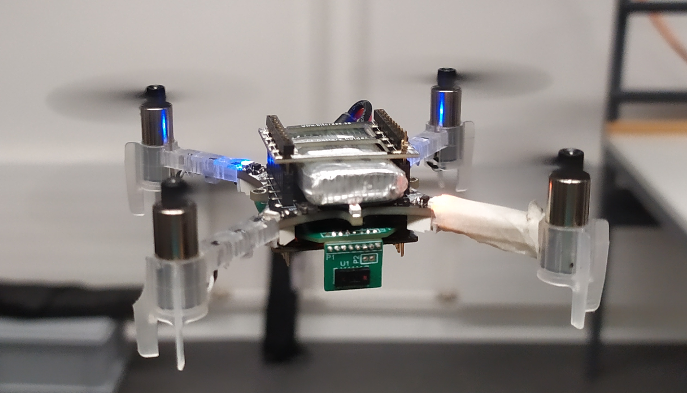
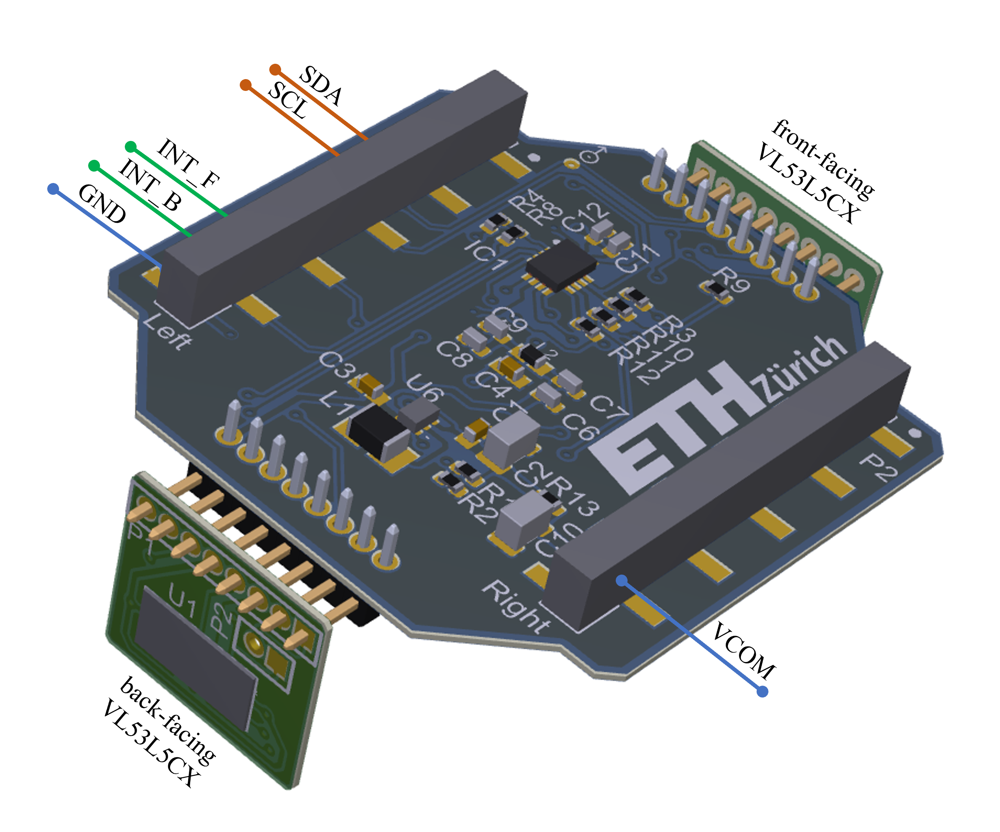
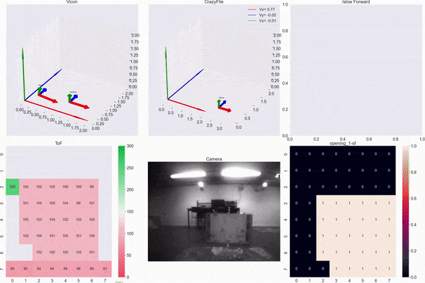

<!--
*** Template source: https://github.com/othneildrew/Best-README-Template/blob/master/README.md
-->

<!-- PROJECT SHIELDS -->
<!--
*** I'm using markdown "reference style" links for readability.
*** Reference links are enclosed in brackets [ ] instead of parentheses ( ).
*** See the bottom of this document for the declaration of the reference variables
*** for contributors-url, forks-url, etc. This is an optional, concise syntax you may use.
*** https://www.markdownguide.org/basic-syntax/#reference-style-links
-->
[![Contributors][contributors-shield]][contributors-url]
[![Forks][forks-shield]][forks-url]
[![Stargazers][stars-shield]][stars-url]
[![Issues][issues-shield]][issues-url]
[![License][license-shield]][license-url]


<!-- PROJECT LOGO -->
<br />
<p align="center">
  <a href="https://github.com/ETH-PBL/H-Watch">
    
  </a>

  <h3 align="center">Matrix_ToF_Drones</h3>
  <h3 align="center">Work in progress - not completed yet</h3>

  <p align="center">
    Indoor Navigation System based on Multi-Pixel Time-of-Flight Imaging for Nano-Drone Applications
    <br />
    <a href="https://github.com/ETH-PBL/Matrix_ToF_Drones"><strong>Explore the docs »</strong></a>
    <br />
    <br />
    <a href="https://youtu.be/FyipTqjBGuM">View Demo</a>
    ·
    <a href="https://github.com/ETH-PBL/Matrix_ToF_Drones/issues">Report Bug</a>
    ·
    <a href="https://github.com/ETH-PBL/Matrix_ToF_Drones/issues">Request Feature</a>
  </p>
</p>


<!-- TABLE OF CONTENTS -->
## Table of Contents

* [About the Project](#about-the-project)
* [Hardware](#hardware)
  * [Components](#hardware)
  * [PCB](#pcb) 
* [Dataset](#dataset)
  * [Dataset Visualizer](#visualizer)
* [Getting Started](#getting-started)
  * [Software](#software)
  


<!-- ABOUT THE PROJECT -->
## About The Project

Unmanned aerial vehicles (UAVs) have recently attracted the industry's attention due to their numerous civilian and potential commercial applications.
A promising UAV sub-class includes nano and micro UAVs, characterized by centimeter size, few grams of payload and extremely limited on-board computational resources. 
Those features pose major challenges to enable autonomous navigation or even more basic relevant sub-tasks, such as reliable obstacle avoidance. This project exploits a multi-zone Time of Flight (ToF) sensor to enable autonomous navigation and obstacle avoidance with a low lower computational load than most common visual-based solutions. 

### Videos and Demos
* [PBL Event: catch me if you can][video1_url]
* [Towards Reliable Obstacle Avoidance for Nano-UAVs][video2_url]
* [Enabling Obstacle Avoidance for Nano-UAVs with a multi-zone depth sensor and a model-free policy][video3_url]


## Hardware

The matrix ToF sensor, and thus this project aims to characterize and in-field evaluate the sensors <a href="www.st.com/en/imaging-and-photonics-solutions/vl53l5cx.html">VL53L5CX</a> from STMicroelectronics using a nano-drone platform. This project exploits a commercial nano-UAV platform, the Crazyflie 2.1 from bitcraze, together with a custom PCB designed to support two 8x8 ToF sensors. The following sections describe in detail the overall framework and the hardware setup.

### Components
The <a href="www.st.com/en/imaging-and-photonics-solutions/vl53l5cx.html">VL53L5CX</a> is a ToF multizone ranging sensor produced by STMicroelectronics. 
It integrates a single-photon avalanche diode (SPAD) array, physical infrared filters, and diffractive optical elements (DOE) to achieve a millimeter accuracy in various ambient lighting conditions with a wide range of cover glass materials. The working range spans between 2 cm and 4 meters, but above 2 m the overall ranging precision degrades to 11% of the absolute distance. The most important feature of the VL53L5CX is the multizone capability, which can be configured as an 8x8 or 4x4 matrix. 
Listed below the list of key components for our integrated deck targetted for the Crazyflie 2.1 platform: 

* [VL53L5CX][VL53L5CX_url],       ToF multizone ranging sensor
* [TPS62233][tps62233_url],       3-MHz Ultra Small Step-Down Converter
* [TCA6408A][tca6408a_url],       Low-Voltage 8-Bit I2C and SMBus I/O Expander

### PCB 
The H-Watchs printed circuit board (PCB) is built of 4 Layers with a total board thichness of only 0.83mm. Further informations about the PCB can be found here:

File                                  | Content
--------------------------------------|--------
[Deck_schematics.pdf]                 | Schematics of the deck that supports 2 VL53L5CX.  
[Deck_PCB_3D.pdf]                     | Layout 3D view with details to components and nets.
[Deck_BOM.xlsx]			      | Bill of material for the Deck PCB.
[Sensor_Board_schematics.pdf]         | Schematic of the lateral PCB that hold one VL53L5CX.
[Sensor_Board_PCB_3D.pdf]             | Layout 3D view with details to components and nets.
[Sensor_Board_BOM.xlsx]               | Bill of material for the sensor board.
[Final_Assembly_3D.pdf]               | Assembly of one Deck PCB together with two sensor board PCBs, front-facing and back-facing directions. 


The preview of the assembly, with details of logical connections can be found here:

<a href="https://github.com/ETH-PBL/H-Watch">
    
</a>

<!-- GETTING STARTED -->

## Dataset

Tests were performed in controlled and open spaces, with the support of a motion capture system (mocap) Vicon Vero 2.2 at a rate of 50 Hz. A human pilot manually steered the Crazyflie. Initially, the dataset was used to develop and test the obstacle avoidance algorithm. However, other researchers can also use it to improve our system by integrating the multi-zone ToF data with processed information from a CNN and the grayscale camera or by applying a more general DNN algorithm to enhance on-board intelligence. 
We collected (a) internal state estimation (attitude, velocity, position) of the Crazyflie, (b) multi-zone ToF array in 8x8 pixel configuration, (c) camera images (QVGA greyscale), (d) Vicon data (attitude, position) in a time series format with millisecond accuracy. The dataset consists of three main groups: object approach moving the drone on a single axis, yaw rotations around the Z-axis, and a general-purpose set of flying tests approaching various obstacles and narrow holes. The first group, named Linear Movements, consists of 10 recordings of flights with (a), (b), (c), and (d) data, approaching a wood panel at different speeds and stopping and flying back always on the same axis, rotations and altitude variations are disabled. The total test time is 216 seconds with an average of 22 seconds per acquisition. The next group, Yaw Rotations, consists of 3 recordings with (a), (b), (c), and (d) data, rotating on a single axis (yaw) at 1 meter from an obstacle. Recorded data reach a total of 94 seconds. The third and final group, named Obstacle Avoidance is composed of 30 recordings with a mixed combination of (a), (b), (c), (d) - 14 acquisitions - and (a), (b), (c) - 16 acquisitions. In total, for the third group, 17 minutes of flight maneuvers are present in the Flight DataSet folder, with an average of 35 seconds per acquisition. 

### Dataset Visualizer

A Conda virtual environment is provided to execute the Flight_visualizer.py script

```
conda env create -f environment.yml
```

then activate the environment using

```
conda activate Matrix_ToF_Drones
```

then run 

```
python Flight_visualizer.py
```

the resulted generated videos will be save to the folder VisualizerResults in the following format:

<a href="https://github.com/ETH-PBL/H-Watch">
    
</a>

## Getting Started

#### Material

* One fully mounted [Deck_schematics.pdf] and two [Sensor_Board_schematics.pdf] assembled as shown here: [Final_Assembly_3D.pdf]
* The [Crazyflie 2.1][crazyflie_url]
* The [Flow Deck v2][flowdeck_url]. The VL53L1x ToF sensor measures the distance to the ground with high precision and the PMW3901 optical flow sensor measures movements of the ground.

#### Software

* [STM32CubeIDE][stmcubeIDE_url]
* Firmware Package FW_WB V1.8.0
* [Altium][altium_url]

### Installation


## Acknowledges

If you use **Matrix ToF Drone** in an academic or industrial context, please cite the following publications:

~~~~
@INPROCEEDINGS{20.500.11850/476189,
	copyright = {Creative Commons Attribution 4.0 International},
	year = {2022},
	author = {Niculescu Vlad, Müller Hanna, Ostovar Iman, Polonelli Tommaso, Magno Michele, Benini Luca},
	keywords = {UAV, nano-drone, autonomous navigation, obstacle avoidance, Time of Flight},
	language = {en},
	title = {Towards a Multi-Pixel Time-of-Flight Indoor Navigation System for Nano-Drone Applications.},
}
~~~~

~~~~
@inproceedings{ostovar2022demo,
  title={Demo Abstract: Towards Reliable Obstacle Avoidance for Nano-UAVs},
  author={Ostovar, Iman and Niculescu, Vlad and M{\"u}ller, Hanna and Polonelli, Tommaso and Magno, Michele and Benini, Luca},
  booktitle={2022 21st ACM/IEEE International Conference on Information Processing in Sensor Networks (IPSN)},
  pages={501--502},
  year={2022},
  organization={IEEE}
}
~~~~


<!-- MARKDOWN LINKS & IMAGES -->
<!-- https://www.markdownguide.org/basic-syntax/#reference-style-links -->

<!--Subsection Hardware-->
[VL53L5CX_url]:     www.st.com/en/imaging-and-photonics-solutions/vl53l5cx.html
[tps62233_url]:     https://www.ti.com/lit/ds/symlink/tps62230.pdf?ts=1642068933103&ref_url=https%253A%252F%252Fwww.ti.com%252Fproduct%252FTPS62230
[tca6408a_url]:     https://www.ti.com/lit/ds/symlink/tca6408a.pdf?ts=1642063709908&ref_url=https%253A%252F%252Fwww.ti.com%252Fproduct%252FTCA6408A
[crazyflie_url]:    https://www.bitcraze.io/products/crazyflie-2-1/
[flowdeck_url]:     https://store.bitcraze.io/collections/decks/products/flow-deck-v2

<!--Subsection PCB-->

[Deck_schematics.pdf]:                    /Hardware/TofDeck/TofDeck.pdf
[Deck_PCB_3D.pdf]:                        /Hardware/TofDeck/Deck_3D.pdf
[Deck_BOM.xlsx]:                          /Hardware/TofDeck/BOM_TofDeck.xlsx
[Sensor_Board_schematics.pdf]:            /Hardware/SensorBoard/SensorBoard.pdf
[Sensor_Board_PCB_3D.pdf]:                /Hardware/SensorBoard/SensorPCB_3D.pdf
[Sensor_Board_BOM.xlsx]:                  /Hardware/SensorBoard/BOM_SensorBoard.xlsx
[Final_Assembly_3D.pdf]:                  /Hardware/MultiBoard_Project/Outputs/Assembly1.pdf


[stmcubeIDE_url]:	https://www.st.com/en/development-tools/stm32cubeide.html
[altium_url]:	        https://www.altium.com/
[video1_url]:	        https://youtu.be/FyipTqjBGuM
[video2_url]:	        https://youtu.be/m9-spY1ruAQ
[video3_url]:	        https://youtu.be/eR2RfNcEVSU


[contributors-shield]: https://img.shields.io/github/contributors/ETH-PBL/Matrix_ToF_Drones.svg?style=flat-square
[contributors-url]: https://github.com/ETH-PBL/Matrix_ToF_Drones/graphs/contributors
[forks-shield]: https://img.shields.io/github/forks/ETH-PBL/Matrix_ToF_Drones.svg?style=flat-square
[forks-url]: https://github.com/ETH-PBL/Matrix_ToF_Drones/network/members
[stars-shield]: https://img.shields.io/github/stars/ETH-PBL/Matrix_ToF_Drones.svg?style=flat-square
[stars-url]: https://github.com/ETH-PBL/Matrix_ToF_Drones/stargazers
[issues-shield]: https://img.shields.io/github/issues/ETH-PBL/Matrix_ToF_Drones.svg?style=flat-square
[issues-url]: https://github.com/ETH-PBL/Matrix_ToF_Drones/issues
[license-shield]: https://img.shields.io/github/license/ETH-PBL/Matrix_ToF_Drones.svg?style=flat-square
[license-url]: https://github.com/ETH-PBL/Matrix_ToF_Drones/blob/master/LICENSE
[product-screenshot]: pics/drone.png
